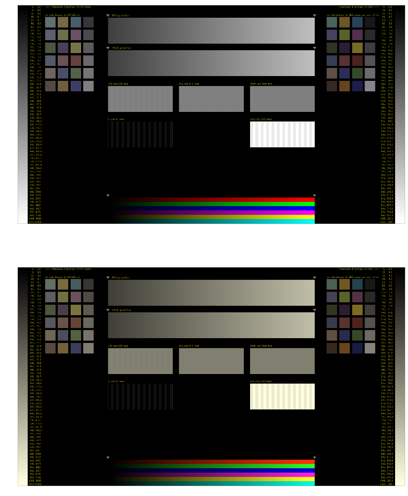

====================
色変換
====================

:著者: Toru Yoshihara (石川県の上位DDRer。最近はHDR-DDR動画の撮影に夢中)
:出版社: Laala Publication

はじめに
--------
さまざまな色空間が混在する現在では色の変換処理がどうしても必要になる。
それを Numpy を使って簡単に実現する。

本ドキュメントでは最初に色変換の簡単な例を示す。その後で
色変換に使う信号処理について解説する。

色変換デモ
-------------

D65 --> D50 への白色点変換
^^^^^^^^^^^^^^^^^^^^^^^^^^^^^^^^^

.. code:: python

    import matplotlib.pyplot as plt
    import color_convert as cc
    import numpy as np
    import cv2
    %matplotlib inline
    
    # 画像ファイル読み込み
    # --------------------------
    img_file_name = "./figures/source.tif"
    before_img = cv2.imread(img_file_name, cv2.IMREAD_ANYDEPTH | cv2.IMREAD_COLOR)
    """ OpenCV は RGB ではなく GBR の順序なので配列の入れ替えをする """
    before_img = before_img[:, :, ::-1]  # GBR --> RGB 変換
    
    # 変換のために 1.0 に正規化
    # --------------------------
    img_max_value = np.iinfo(before_img.dtype).max
    after_img = before_img / img_max_value
    
    # ガンマ解除してリニア空間に戻す
    # --------------------------------
    after_img = after_img ** 2.2
    
    # D65 --> D50 に変換
    # -------------------------
    src = cc.const_d65_large_xyz
    dst = cc.const_d50_large_xyz
    convert_matrix = cc.get_white_point_conv_matrix(src, dst)
    after_img = cc.color_cvt(after_img, convert_matrix)
    
    # オーバーフロー、アンダーフローの処理
    # --------------------------------------
    """
    オーバーフロー処理も cc.color_cvt() に含めるべきかと思ったが
    汎用性が減少するのでやめた。
    """
    ng_idx_overflow = after_img > 1.0
    ng_idx_underflow = after_img < 0.0
    after_img[ng_idx_overflow] = 1.0
    after_img[ng_idx_underflow] = 0.0
    
    # ガンマをかけ直す
    # ---------------------------------
    after_img = after_img ** (1 / 2.2)
    
    # 1.0 に正規化していたのを元に戻す
    # ---------------------------------
    after_img = np.round(after_img * img_max_value)
    after_img = after_img.astype(before_img.dtype)  # 型をfloat型からint型へ
    
    # 比較表示
    # ---------------------------------
    fig = plt.figure(figsize=(32, 18))
    ax1 = fig.add_subplot(211)
    ax2 = fig.add_subplot(212)
    ax1.set_axis_off()
    ax2.set_axis_off()
    ax1.imshow(before_img / img_max_value)  # 整数型だと表示が乱れたので浮動小数点型にした
    ax2.imshow(after_img / img_max_value)
    plt.show()

REC709 --> REC2020 への色域変換
^^^^^^^^^^^^^^^^^^^^^^^^^^^^^^^^^^^^^^^^

.. code:: python

    import matplotlib.pyplot as plt
    import color_convert as cc
    from scipy import linalg
    import numpy as np
    import cv2
    import imp
    %matplotlib inline
    
    imp.reload(cc)
    
    # 画像ファイル読み込み
    # --------------------------
    img_file_name = "./figures/source.tif"
    before_img = cv2.imread(img_file_name, cv2.IMREAD_ANYDEPTH | cv2.IMREAD_COLOR)
    before_img = before_img[:, :, ::-1]  # GBR --> RGB 変換
    
    # 変換のために 1.0 に正規化
    # --------------------------
    img_max_value = np.iinfo(before_img.dtype).max
    after_img = before_img / img_max_value
    
    # ガンマ解除してリニア空間に戻す
    # --------------------------------
    after_img = cc.rec709_to_linear(after_img)
    
    # REC709 --> REC2020 に変換
    # ---------------------------
    src_gamut = cc.const_rec709_xy
    src_white = cc.const_d65_large_xyz
    dst_gamut = cc.const_rec2020_xy
    dst_white = cc.const_d65_large_xyz
    rec709_to_xyz_mtx = cc.get_rgb_to_xyz_matrix(src_gamut, src_white)
    rec2020_to_xyz_mtx = cc.get_rgb_to_xyz_matrix(dst_gamut, dst_white)
    xyz_to_rec2020_mtx = linalg.inv(rec2020_to_xyz_mtx)
    convert_matrix = rec709_to_xyz_mtx.dot(xyz_to_rec2020_mtx)
    after_img = cc.color_cvt(after_img, convert_matrix)
    
    # オーバーフロー、アンダーフローの処理
    # --------------------------------------
    """
    オーバーフロー処理も cc.color_cvt() に含めるべきかと思ったが
    汎用性が減少するのでやめた。
    """
    ng_idx_overflow = after_img > 1.0
    ng_idx_underflow = after_img < 0.0
    after_img[ng_idx_overflow] = 1.0
    after_img[ng_idx_underflow] = 0.0
    
    # ガンマをかけ直す
    # ---------------------------------
    after_img = cc.linear_to_rec709(after_img)
    
    # 1.0 に正規化していたのを元に戻す
    # ---------------------------------
    after_img = np.round(after_img * img_max_value)
    after_img = after_img.astype(before_img.dtype)  # 型をfloat型からint型へ
    
    # 比較表示
    # ---------------------------------
    fig = plt.figure(figsize=(32, 18))
    ax1 = fig.add_subplot(211)
    ax2 = fig.add_subplot(212)
    ax1.set_axis_off()
    ax2.set_axis_off()
    ax1.imshow(before_img / img_max_value)  # 整数型だと表示が乱れたので浮動小数点型にした
    ax2.imshow(after_img / img_max_value)
    plt.show()

技術説明
-----------------------

画像ファイルの扱い
^^^^^^^^^^^^^^^^^^^^^^^
書くの面倒になってきた…