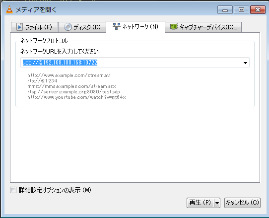

# Streaming

動画配信についてのノウハウを書いていく。


# ffmpeg を使ったやつ

[FFmpeg wiki StreamingGuide](https://trac.ffmpeg.org/wiki/Capture/Desktop) <br>
[公式ドキュメント(gdigrab)](https://www.ffmpeg.org/ffmpeg-devices.html#gdigrab) 

## 画面をキャプチャしてファイルに保存

### ffmpeg 側の設定

```
> ffmpeg -f gdigrab -draw_mouse 1 -show_region 1 -framerate 30 -video_size 1280x720 -offset_x 0 -offset_y 60 -i desktop -c:v libx264 -crf 24 -pix_fmt yuv420p out.mp4
```

| パラメータ | 役割                     | 備考                            |
|:---------------|:-------------------------|:--------------------------------|
| -f gdigrab | Windowsの画面を入力として使う | Linuxの場合は x11grab を使う |
| -draw_mouse | マウスポインタも描画 | 0 なら非表示 |
| -show_resion | キャプチャ領域を枠で囲む | 0 なら非表示 |
| -offset_x | 画面左上からのx方向オフセット | - |
| -offset_y | 画面左上からのy方向オフセット | - |
| -i desktop | キャプチャ対象をデスクトップ全体に指定 | アプリ個別指定も出来るらしい… |
| -c:v libx264 | エンコーダにH.264 を指定 | - |
| -crf | 画面品位の選択 | 数値が低いほど高画質。-crf 0 で非圧縮 |


## 画面をキャプチャして UDP で配信

UDPでネットワークにキャプチャ画面を流し、VLCで再生することを考える。

### ffmpeg 側の設定

```
> ffmpeg -f gdigrab -draw_mouse 1 -show_region 1 -framerate 30 -video_size 1280x720 -offset_x 0 -offset_y 60 -i desktop -c:v libx264 -crf 24 -f:v mpegts udp://192.168.100.168:10722
```

### VLC 側の設定

VLCで メディア→ネットワークストリームを開く の順にメニューをたどり、`udp://@192.168.100.168:10722` とアドレス指定する。

IPアドレスの前に **＠** が必要なことに注意。


