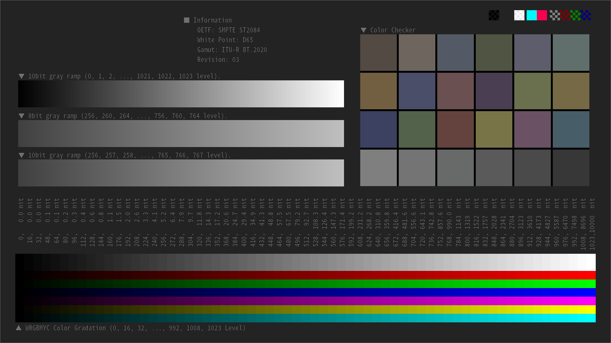
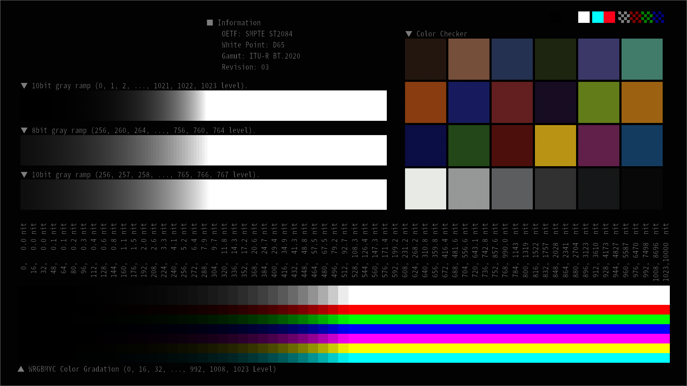
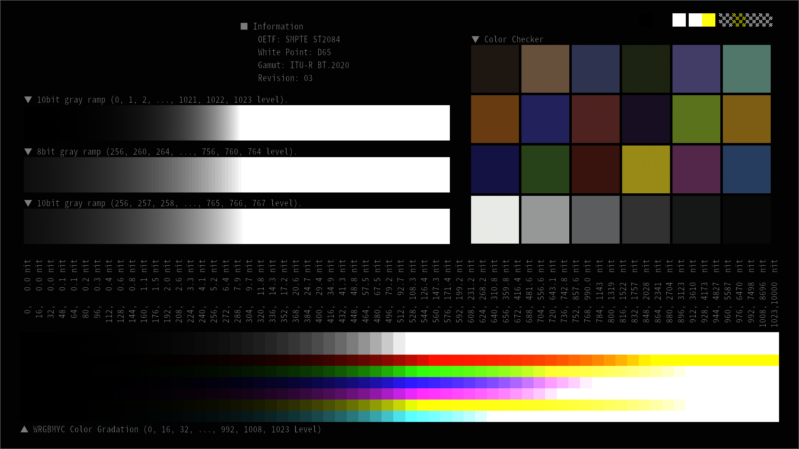
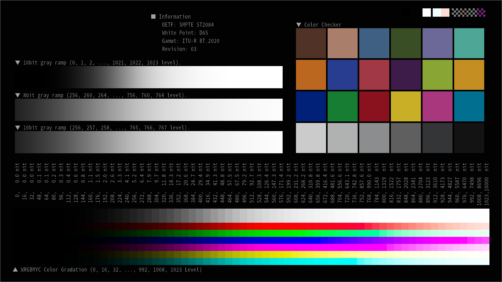

# RRT+ODTを実行する 1DLUT & 3DLUT の作成(一部失敗)

## 目的

 ACES の RRT+ODT を実行する 1DLUT & 3DLUT を自作する。

## 背景

RRT+ODT を実行する 1DLUT & 3DLUT は既に Sony Picture Imageworks が公開している[1]。しかし、ここで公開されている LUT は ```minExposure``` や ```maxExposure``` 等のパラメータが固定化されており、細かな精度評価を行う場合には少々不便である。ということで自由にパラメータ設定できる 1DLUT & 3DLUT を自作することにした。

## 結論

ごく一部の色を除き RRT+ODT を 1DLUT & 3DLUT で実現することに成功した。評価用パターンに RRT+ODT を適用した様子を図1に示す。左上に Reference と書かれているのが正解画像、1DLUT & 3DLUT と書かれているのが、自作の LUT で変換した画像である。

図1の右下を注意深く観察すると W, R, G, B, M, Y, C のグラデーションのうち、Blue と Majenta の高輝度箇所の色がズレてしまっている。こうした結果だったため タイトルに「一部失敗」と付け加えた。


なお、一部失敗の原因については別記事で考察する予定である。本記事では引き続き 1DLUT & 3DLUT の作成方法を解説する。

## 下準備

初めに、作成した 1DLUT & 3DLUT が正しいかを判断するための Reference となる実行結果を用意することにした。用意したものを図2に示す。本記事の後半で 1DLUT & 3DLUT での変換結果が図2 と一致するかの判定を行う。


<figure class="figure-image figure-image-fotolife" title="図2. reference となるテストパターン">[f:id:takuver4:20190805003045p:plain]<figcaption>図2. reference となるテストパターン</figcaption></figure>

図2 の作り方を簡単に説明する。以下の4ステップで作成した。

1. OETF: SMPTE ST2084(PQカーブ)、Gamut: BT.2020, White: D65 のテストパターンを作成。
2. テストパターンに ST2084 の EOTF を適用して Linear値に変換。
3. テストパターンの Gamut を BT.2020 --> AP0 に変換（RRTは AP0 を前提としているため）。
4. ```ctlrender```[2] を使用してテストパターンに RRT+ODT を適用。16bit TIFF で保存。

各ステップでのテストパターン様子を図3に示す。なお、手順4. で使用した ```ctlrender``` の細かい使用方法は本記事では解説しない。興味がある場合は以下の過去記事を参照すること[3]。

[https://trev16.hatenablog.com/entry/2019/06/01/155644:embed:cite]

|  |  |
|:-----:|:-----:|
|  |  |
|  |  |

<div style="text-align: center;">図3. 各ステップの様子。左上、右上、左下、右下の順に Step1～4が並んでいる。</div>
|  |  |
|:-----:|:-----:|
|    [f:id:takuver4:20190806004336p:plain]    |     [f:id:takuver4:20190806004347p:plain]    |
|   [f:id:takuver4:20190806004358p:plain]     |    [f:id:takuver4:20190806004411p:plain]     |

## 1DLUT の作成

1DLUT は以下の記事で述べた通り、3DLUT 適用時の低輝度部分の精度低下を防ぐために使用する。

[https://trev16.hatenablog.com/entry/2019/06/20/010121:embed:cite]

今回はソース画像が 10000nits、すなわち Linear値で 100.0 の値を持っていたため、```maxExposure = 10.0 ``` とした。すなわち Linear 値で [tex: { 0.18 \times 2^{10} = 184.32 }] までの値を 3DLUT を使った変換の対象範囲とした。また、最小値に関しては ```minExposure = -10.0 ``` とした。これは ```midgray``` を中心に高輝度方向と低輝度方向に均等に情報を割り当てるためである。

上で紹介した[過去記事](https://trev16.hatenablog.com/entry/2019/06/20/010121)の計算式を使い、```maxExposure = 10.0 ```, ```minExposure = -10.0 ```, ```midgray = 0.18``` をパラメータとした Linear to Log2 を行う 4096点の 1DLUT を作成した。生成したデータはコレである。

## 3DLUT の作成

3DLUT は以下の○ステップで作成した。

1. 3DLUTの格子点の配列を作成
2. 格子点の配列を R, G, B の画像ファイルとみなして OpenEXR 形式で保存
3. OpenEXR ファイルに Log2 to Linear 変換を実行
4. ```ctlrender``` を使用して RRT+ODT を適用
5. ```ctlrender``` の結果の画像を 3DLUT の LUT値 としてファイルほ保存

## 参考資料

[1] imageworks, "OpenColorIO-Configs", https://github.com/imageworks/OpenColorIO-Configs

[2] ampas, "ctlrender", https://github.com/ampas/CTL/tree/master/ctlrender

[3] toruのブログ, "CTLで記述された ACES の RRT と ODT を画像に適用する", https://trev16.hatenablog.com/entry/2019/06/01/155644