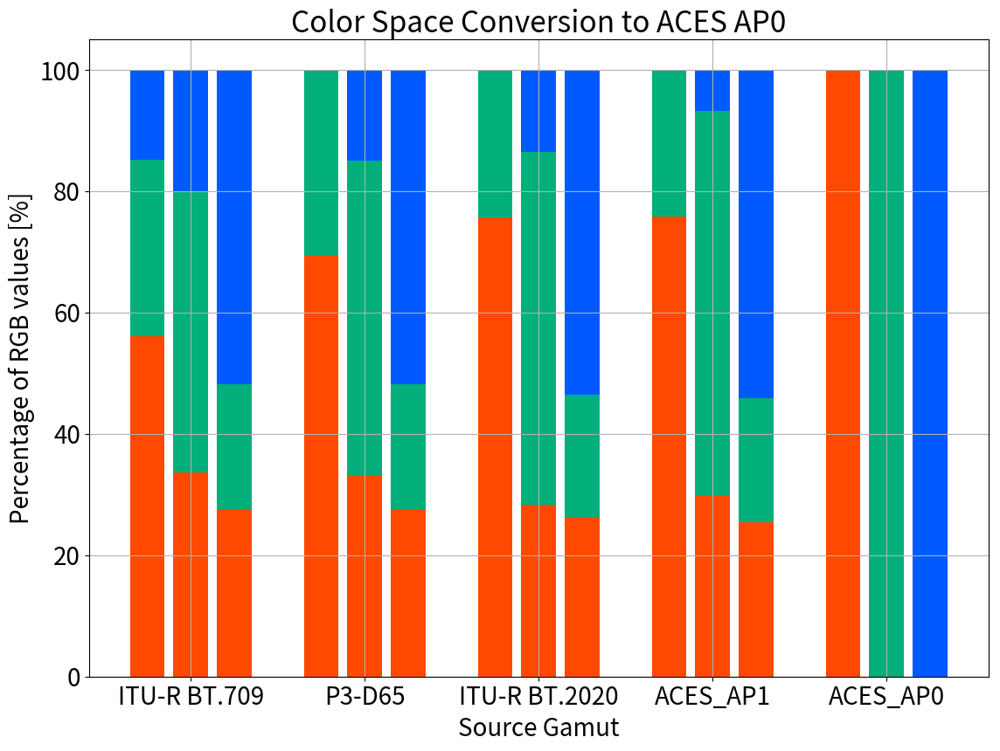
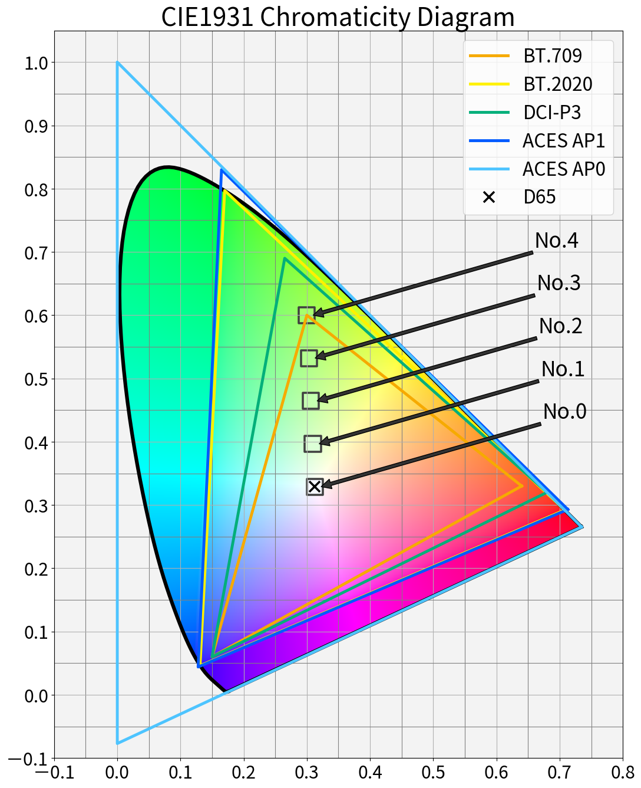
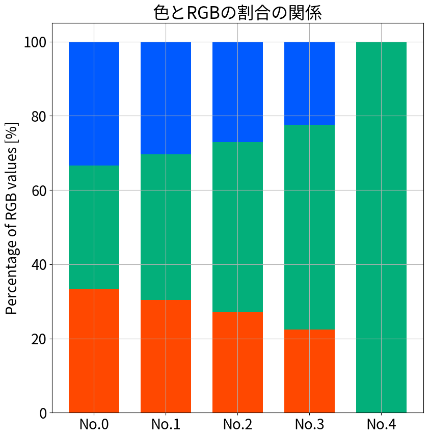

# 色域変換に伴う Primary Colors の RGB値の変化

## 1. 目的

* Primary Colors を色域変換すると Primary Colors で無くなることを確認する(※1)
* 確認の際の可視化方法を工夫して少しでも分かりやすくする。

※1例：Red を BT.709 → BT.2020 に変換すると、(1023, 0, 0) → (642, 71, 17) となり、Rチャネル以外にも値が生じる。
即ち Primary Colors では無くなる。

## 2. 背景

ACES の RRT関連の調査をしていて久々に恥ずかしい勘違いをしてしまったので、自戒の念を込めて記事を書くことにした。

## 3. 結論

Primary Colors を色域変換すると Primary Colors で無くなる。
各色域の Primary Colors を ACES AP0 へ色域変換した結果を図1に示す。図の見方は後述の4.3.を参照。



## 4. 証明

愚直に R, G, B の Primary Colors を色域変換して確認した。
以下の順序で説明する。

* 色域変換のコード
* 色とRGBの比率と可視化
* Primary Colors の色域変換前後の可視化

なお、本検証は Gamma=2.4 として行った。Linear値をGamma補正する際は ```rgb = linear_rgb ** (1/2.4)``` の計算をしていることに注意すること。

### 4.1. 色域変換のコード

例によって Colour Science for Python[1] を使用する。```colour.RGB_to_RGB``` を使えば瞬殺である。
BT.709 の Red の Primary を BT.2020色域へ変換した場合の例を以下に示す(※2)。

※2 chromatic adaptation は "XYZ Scaling" を選択すること。"Bradford" や "CAT02" は色温度変換の計算で Primary Colors の値が変わってしまう([2]より自明)。

```python
>>> import numpy as np
>>> from colour import RGB_to_RGB
>>> from colour.models import BT709_COLOURSPACE, BT2020_COLOURSPACE
>>> chromatic_adapdation = "XYZ Scaling"
>>> bt709_red = np.array([1023, 0, 0]) / 1023
>>> gamma = 2.4
>>> ap0_red = RGB_to_RGB(bt709_red, BT709_COLOURSPACE, BT2020_COLOURSPACE, chromatic_adapdation)
>>> print(np.uint16(np.round((ap0_red ** (1/gamma)) * 1023)))
[842 336 184]
```

### 4.2. 色とRGBの比率と可視化

4.1. の計算結果を提示すれば証明は完了するのだが、少しでも結果を分かりやすく提示するために、可視化の方法を少々工夫しようと思う。

液晶ディスプレイのように**光の三原色**で表示する「色」は R, G, B の比率が大変重要である。
輝度成分(Y)を考えなければ、xy色度図上の色は R, G, B の比率で表現可能である。

例えば、図2のように D65 の白色点から Green の Primary への色変化に着目してみよう。
この時の No.0～No.4 の RGB値は表2となる。白色点から Green Priamry への変化では、
Red, Blue の割合が減少して行くことが読み取れる。



|No.|R|G|B|
|:---|---:|---:|---:|
|0|1023| 1023| 1023|
|1| 792| 1023|  792|
|2| 603| 1023|  603|
|3| 416| 1023|  416|
|4|   0| 1023|    0|

ここで表2について少し考える。表2は正確な値を知るには良いが R, G, B の**比率**を可視化する上では少々見づらい。そこで 100% 積み上げ棒グラフで表2の値を表現してみる。結果を図3に示す。



No.0～No.4 への変化に伴い Green の割合が増大しているのが視覚的に分かりやすくなったと考える。

### 4.3. 色域変換前後の Primary Colors の可視化

さて、話を元に戻そう。BT.709, DCI-P3, BT.2020, ACES AP1 の Primary Colors を ACES AP0 に変換することで、R, G, B の割合にどのような変化が生じるかを確認する。

変換後のRGB値は以下のコードで算出できる。

```python
>>> import numpy as np
>>> from colour import RGB_COLOURSPACES
>>> from colour import RGB_to_RGB
>>> ACES_AP0 = 'ACES2065-1'
>>> ACES_AP1 = 'ACEScg'
>>> cs_name_list = ['ITU-R BT.709', 'P3-D65', 'ITU-R BT.2020', ACES_AP1, ACES_AP0]
>>> dst_cs = RGB_COLOURSPACES[ACES_AP0]
>>> src_primaries = [[1.0, 0.0, 0.0], [0.0, 1.0, 0.0], [0.0, 0.0, 1.0]]
>>> src_primaries = np.array(src_primaries)
>>> dst_primaries = {}
>>> gamma = 2.4
>>> for src_cs_name in cs_name_list:
...     src_cs = RGB_COLOURSPACES[src_cs_name]
...     chromatic_acaptation = "XYZ Scaling"
...     temp = RGB_to_RGB(src_primaries, src_cs, dst_cs, chromatic_acaptation)
...     temp = np.clip(temp, 0.0, 1.0)
...     dst_primaries[src_cs_name] = temp ** (1/gamma)
... 
>>> print(dst_primaries)
{'ITU-R BT.709': array([[ 0.7061942 ,  0.36462193,  0.1864231 ],
                        [ 0.66544985,  0.91841811,  0.39780414],
                        [ 0.50039224,  0.37655308,  0.94489081]]),
 'P3-D65': array([[ 0.75658381,  0.33527762,  0.        ],
                  [ 0.58796478,  0.92158739,  0.26537257],
                  [ 0.52032333,  0.39155153,  0.98252668]]),
 'ITU-R BT.2020': array([[  8.46432469e-01,   2.72570817e-01,   1.55687188e-07],
                         [  4.56353160e-01,   9.39899075e-01,   2.17777907e-01],
                         [  4.86714011e-01,   3.73451290e-01,   9.89177697e-01]]), 
 'ACEScg': array([[ 0.85956366,  0.27416407,  0.        ],
                  [ 0.44166719,  0.93894137,  0.10046048],
                  [ 0.47065976,  0.37589489,  1.        ]]),
 'ACES2065-1': array([[  1.00000000e+00,   4.64557456e-05,   0.00000000e+00],
                      [  0.00000000e+00,   1.00000000e+00,   0.00000000e+00],
                      [  2.34024561e-05,   4.41013794e-05,   1.00000000e+00]])}
```

これを積み上げ棒グラフで可視化したものが冒頭の3.結論で示した図1である。色域ごとに R, G, B の3色をプロットした。色域が小さいほど、他チャンネルの成分が混じっていることが視覚的に分かる。図3より、Primary Colors を色域変換すると Primary Colors で無くなることを確認できた。

## 5. 考察

かなり話が飛ぶが、ACES の RRT では内部で AP0 → AP1 変換を行い、AP1の色域でトーンカーブを適用する。したがって、BT.709 や DCI-P3 の Primary Colors はトーンカーブ適用時には Primary Colors では無くなっている。この事実は非常に重要である。自分はココを勘違いしていた。反省。

## 6. 参考文献

[1] Colour Science, Colour Science for Python, https://www.colour-science.org/

[2] Bruce Justin Lindbloom, Chromatic Adaptation, http://www.brucelindbloom.com/index.html?Eqn_ChromAdapt.html
