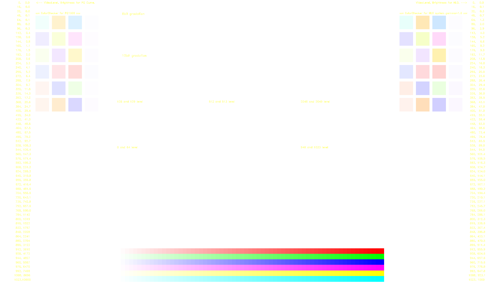
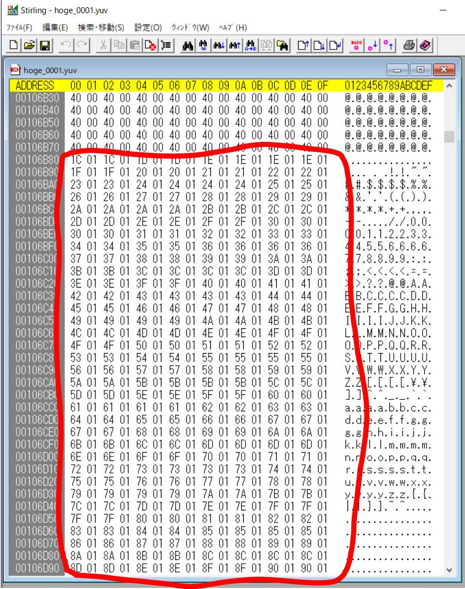

# 目的
10bitエンコード出来ているか確認する。

# 準備

## 静止画の元ネタ作成
source のテストパターン画像を作る。

```
import test_pattern_generator as tpg
tpg.make_m_and_e_test_pattern(size="fhd")
```



## 静止画の連番ファイルを作成

```
import h264_10bit_movie as h1m
h1m.make_source_tiff()
```

# エンコード
[リンク先のページ](https://github.com/toru-ver4/sip/tree/develop/signal_generation/ffmpeg_tiff#annex-a-10bit-hevc-encode)を参考に10bit対応版の ffmpeg をコンパイルしておくこと。

以下のコマンドを実行

```
> ffmpeg -r 24 -i img/test_img_%04d.tif -r 24 -c:v libx264 -crf 10 -pix_fmt yuv420p10le test_img_10bit.mp4
```

# エンコードされたデータの解析

動画プレイヤー上で10bitに見えたとしても、それは 8bit＋ディザリング の結果という事もある(というか以前にあった)。そこで、動画データを解析する。

## 静止画ファイルの生成
動画データを解析するために .mp4 --> .yuv 変換を行う。

※ .mp4 --> .tif 変換も試したが ffmpeg 内部の YUV --> RGB 変換により下位bit にゴミデータが入ったため断念した。

```
> ffmpeg -i test_img_10bit.mp4 -ss 0 -t 1 -c:v rawvideo -f image2 -pix_fmt yuv420p10le verify/hoge_%04d.yuv
```

## 静止画ファイルの解析

.yuv ファイルはアドレスの若い方に Y データが16bit長で詰まっている。その情報を元に バイナリエディタでデータを解析した結果が以下。



上の 0x40 は 64 で Limited Range の黒レベルを意味している。その先のグラデーションでは最下位bitが1ずつインクリメントしており、確かに10bitデータであることが解かる。

