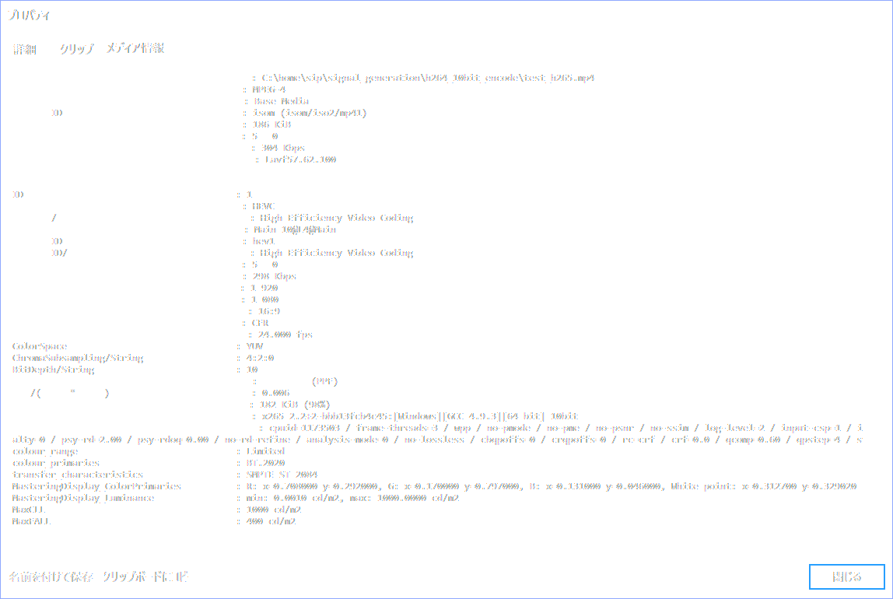

# 目的
HDR10 に対応した動画を作る。

# 条件整理

## HDR10 とは

CTA とかいう団体が決めた規格のようなもの。詳しい説明は[wikipedia](https://en.wikipedia.org/wiki/High-dynamic-range_video#HDR10)を参照。コアの部分だけぶっこ抜くと[この記事](https://www.cta.tech/News/Press-Releases/2015/August/CEA-Defines-%E2%80%98HDR-Compatible%E2%80%99-Displays.aspx)に書かれている「HDR10 Media Profile」ってやつが実態だ。

定義部分をまるごと引用すると以下となる。

```
* Note: HDR10 Media Profile is defined as:
    EOTF: SMPTE ST 2084
    Color Sub-sampling: 4:2:0 (for compressed video sources)
    Bit Depth: 10 bit
    Color Primaries:  ITU-R BT.2020
    Metadata: SMPTE ST 2086, MaxFALL, MaxCLL 
```

Metadata の 「SMPTE ST 2086, MaxFALL, MaxCLL」に関しては [リンク先](https://www.linkedin.com/pulse/hdr-10-metadata-smpte-st2086-maxfall-maxcll-carlos-carmona) を参照。

## どうやって作るのか？
俺が知っているやり方は２つ。

1. H.265 の SEI(※)に Metadata を入れて作る
2. mkv コンテナに Metadata を入れて作る

※：Supplemental Enhancement Information

2.のメリットはコーデックに H.265 を使わなくても良い点。YouTube にHDR動画をアップロードする場合はこの方式が使われる。

今回は .mp4 コンテナに動画を入れたかったので 1.の方式で実行する。

# 準備

## 10bit対応 ffmpeg
[リンク先のページ](https://github.com/toru-ver4/sip/tree/develop/signal_generation/ffmpeg_tiff#annex-a-10bit-hevc-encode)を参考に10bit対応版の ffmpeg をコンパイルする。

## 動画ソースの準備
[ここ](https://github.com/toru-ver4/sip/tree/feature/OpenColorIO/signal_generation/h264_10bit_encode)を参考に。

# HDR10動画の作成

## 結論
以下のコマンドを実行する。

```
> ffmpeg -r 24 -i img/test_img_%04d.tif -r 24 -c:v libx265 -x265-params crf=0:colorprim=9:transfer=16:max-cll=1000,400:master-display=G(8500,39850)B(6550,2300)R(35400,14600)WP(15635,16451)L(10000000,10) -pix_fmt yuv420p10le hdr10_movie.mp4
```

※ crf=0 は検証のためである。0である必要性は無い。

## 引数の意味
[x265レファレンス](https://x265.readthedocs.io/en/default/cli.html#cmdoption-colorprim)を参照

## master-display パラメータ
master-display のパラメータは計算するのが面倒なので、よく使うものを下に挙げておく。

```
# code
import hdr10_movie as hm
print(hm.get_hdr10_info_for_x265(gamut='rec709'))
print(hm.get_hdr10_info_for_x265(gamut='rec2020'))
print(hm.get_hdr10_info_for_x265(gamut='dci-p3'))
print(hm.get_hdr10_info_for_x265(gamut='dci-d65'))

# result
G(15000,30000)B(7500,3000)R(32000,16500)WP(15635,16451)L(10000000,10)
G(8500,39850)B(6550,2300)R(35400,14600)WP(15635,16451)L(10000000,10)
G(13250,34500)B(7500,3000)R(34000,16000)WP(15700,17550)L(10000000,10)
G(13250,34500)B(7500,3000)R(34000,16000)WP(15635,16451)L(10000000,10)
```

# 確認
MPC-BE の メディア情報 表示機能を使って確認。

